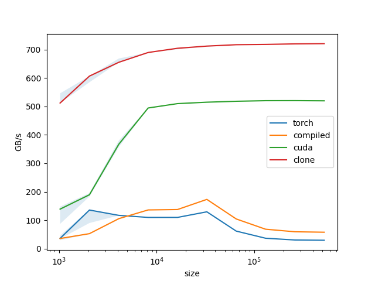

# Minimal Causal Depthwise Conv1d

This repo contains a minimal implementation of the causal depthwise Conv1d operation in CUDA. It is likely less performant than https://github.com/Dao-AILab/causal-conv1d but perhaps more readable. The main purpose is for (self) pedagogy, but the performance can still be much faster than the `torch.compile` generated kernels.

The examples in this repo work with PyTorch 2.4+.

To build:
```
pip install .
```

To test + benchmark:
```
python test/test.py
```
<p align="center">
  
</p>

## Current Limitations

- Only supports fp16 input, fp32 kernel -> fp16 output
- Only supports transposed input of size (batch, length, channels) and kernel of size (4, channels), prominently used in Mamba
- The layer is fused with SiLU (but can be easily modified)
